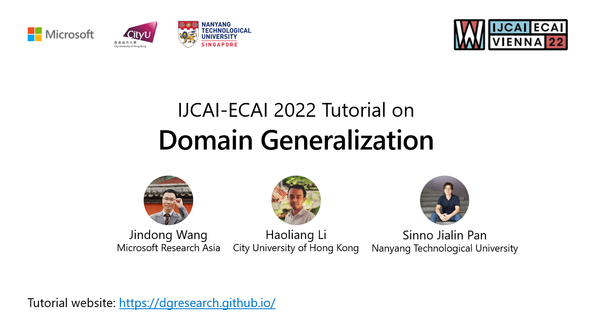

<h1 align="center">IJCAI-ECAI'22 Tutorial on Domain Generalization</h1>

[<a href="https://github.com/dgresearch/dgresearch.github.io/raw/main/DGtutorial_ijcai22.pdf">Slides</a>]
[<a href="https://jd92.wang/assets/files/DG_survey_TKDE22.pdf">Paper</a>]
[<a href="https://github.com/jindongwang/transferlearning/tree/master/code/DeepDG">Code</a>]
[<a href="https://recorder-v3.slideslive.com/#/share?share=68083&s=082db7e5-96ee-4eba-a4a4-92050f2ea7f6">Video</a>]

  

## Introduction

Machine learning model relies heavily on the availability of massive training data. For low-resource scenarios where the well-labeled data is hard to obtain, it is important to conduct cross-domain knowledge transfer to from the existing domains to the target domain. For this problem, great progress has been made in transfer learning and domain adaptation areas. Beyond these advances, it is of great importance to learn models that can generalize well in any new unseen environment.
This motivates the research community to develop algorithms to better harness the existing training domains while handling their distribution shift.

This tutorial is dedicated to introducing the latest advancements in Domain Generalization (DG).
Different from transfer learning and domain adaptation that assume the availability of target domain data, DG takes a step further that does not require the access of target data. The purpose of DG is to learn a generalized model from one or several training domains with different probability distributions that can achieve good out-of-distribution generalization. The potential audience will be machine learning researchers and industry practitioners, with special interest in transfer learning, domain adaptation and generalization. Our tutorial aims to make these techniques easier to learn and use in real applications.

## Presenters

- [Jindong Wang](http://jd92.wang), Microsoft Research Asia, jindong.wang (at) microsoft.com
- [Haoliang Li](https://hlli1991.github.io/), City University of Hong Kong, haoliang.li (at) cityu.edu.hk
- [Sinno Jialin Pan](https://personal.ntu.edu.sg/sinnopan/), Nanyang Technological Universify, sinnopan (at) ntu.edu.sg

## Outline

- Introduction and background
- Related research areas
- Methodology of DG
- Applications
- Datasets, benchmarks, and evaluations
- Theory and future challenges

## Codebase

DeepDG: https://github.com/jindongwang/transferlearning/tree/master/code/DeepDG

## Reference

- Wang et al. Generalizing to unseen domains: a survey on domain generalization. IEEE Transactions on Knowledge and Data Engineering (TKDE) 2022: https://arxiv.org/abs/2103.03097
